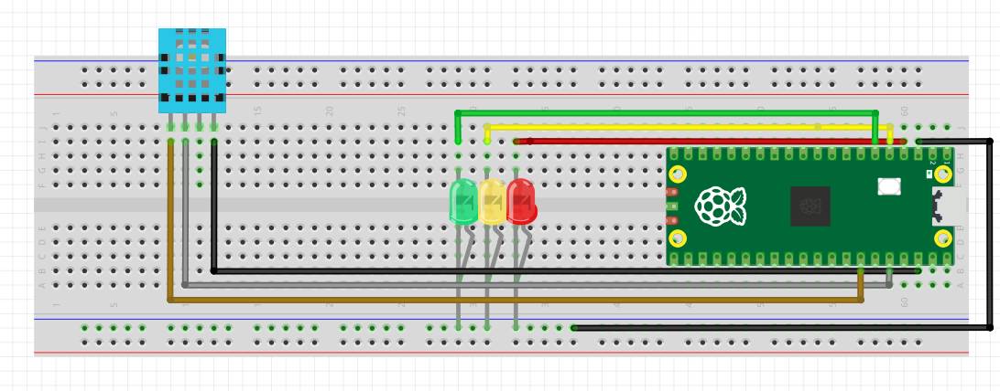

# Raspberry Pi Pico WH IoT Weather Station

This project uses a Raspberry Pi Pico WH microcontroller connected to a DHT11 temperature and humidity sensor and a set of LEDs to create a simple weather station that sends data wirelessly to Adafruit IO, a cloud platform for IoT data visualization and logging.

## Project Overview

- The **DHT11 sensor** measures temperature and humidity.
- The **Pico WH** connects to a Wi-Fi network to send sensor readings to Adafruit IO.
- The device uses **LED animations** to indicate status (e.g., loading or activity).
- The code is organized into separate modules for better maintainability, including Wi-Fi connection, sensor reading, LED control, and Adafruit IO communication.
- Sensor data is sent regularly (every 10 seconds) to specific feeds on Adafruit IO, allowing remote monitoring of the environmental conditions.

## Hardware Components

- Raspberry Pi Pico WH (with built-in Wi-Fi)  
- DHT11 temperature and humidity sensor  
- 3 LEDs with appropriate resistors for visual feedback  
- Breadboard and jumper wires for connections  
- USB cable for power and programming  

## How It Works

1. On startup, the Pico connects to the specified Wi-Fi network using credentials stored securely in a separate file.
2. The DHT11 sensor is read to gather current temperature and humidity data.
3. LEDs run a simple loading animation while sensor readings and data transmission occur.
4. Sensor data is posted to Adafruit IO feeds via HTTP requests using the Pico’s Wi-Fi connection.
5. This cycle repeats indefinitely, updating the cloud dashboard regularly.

## Understanding My Data Flow: From Sensor to Cloud

My IoT weather station's core function is to continuously monitor environmental conditions and transmit that data online. This process highlights the essence of **Internet of Things (IoT)**, where physical objects (my sensor and Pico) connect and communicate over the internet.

---

### 1. Sensor Data Acquisition

The journey begins with my **DHT11 temperature and humidity sensor**, which is physically connected to my Raspberry Pi Pico WH. My MicroPython code, specifically the `dht_sensor.measure()` command, instructs the sensor to actively read the current ambient temperature and relative humidity. The DHT11 then digitizes these environmental measurements and sends them to the Pico's designated GPIO pin.
```python
import time
import dht
from machine import Pin
import wifi_connect
import adafruit_io
import leds

# Setup sensor
dht_sensor = dht.DHT11(Pin(28))

# Connect to WiFi
wifi_connect.connect_wifi()

while True:
    leds.loading_animation()

    try:
        dht_sensor.measure()
        temp = dht_sensor.temperature()
        hum = dht_sensor.humidity()

        print(f"Temperature: {temp}°C, Humidity: {hum}%")

        # Send to Adafruit IO
        adafruit_io.send_data("temperature", temp)
        adafruit_io.send_data("humidity", hum)

    except Exception as e:
        print("Error reading sensor:", e)

    leds.all_off()
    time.sleep(10)  # wait before next reading

```

---

### 2. Pico Processing and Preparation

Once the Pico receives the raw digital signals from the DHT11, my MicroPython script processes these into usable temperature (in Celsius) and humidity (as a percentage) values. I often display these values in the serial console for real-time verification. During this crucial data acquisition phase, my custom **LED loading animation** provides visual feedback, indicating that the device is actively working.

---

### 3. Establishing Wi-Fi Connectivity

This step is fundamental to the "Internet" aspect of IoT. My Raspberry Pi Pico WH utilizes its **built-in Wi-Fi module** to connect to my local 2.4 GHz network. The `wifi_connect.connect_wifi()` function manages this process, securely using credentials (like SSID and password) stored separately from the main script. A robust Wi-Fi connection is absolutely essential for enabling any remote data transmission.

---

### 4. Transmitting Data to Adafruit IO Cloud

With a stable Wi-Fi connection, the Pico can now communicate with **Adafruit IO**, my chosen **cloud platform** for IoT data. The lines `adafruit_io.send_data("temperature", temp)` and `adafruit_io.send_data("humidity", hum)` orchestrate this transmission. These functions are essentially initiating **HTTP POST requests** to Adafruit IO's servers. Each request contains:

* My unique **Adafruit IO username and API key** for authentication.
* The specific **feed name** (e.g., "temperature" or "humidity") to direct the data to the correct storage location.
* The actual **sensor reading** (e.g., `23.0` for temperature or `50.5` for humidity).

---

### 5. Cloud-Based Data Logging and Visualization

Upon receiving the data, Adafruit IO performs two key functions:

* **Data Logging:** Every single data point sent from my Pico is timestamped and permanently stored. This builds a valuable **historical record** of environmental conditions.
* **Visualization:** Adafruit IO automatically generates **dynamic, real-time graphs** for each feed. These visualizations allow me to remotely monitor trends, analyze patterns, and observe immediate changes in temperature and humidity from any web browser or mobile device, truly embodying the remote monitoring capability of IoT.

This entire cycle repeats continuously, every 10 seconds, forming a seamless and automated data pipeline from the physical world to my digital dashboard. It's a clear demonstration of a practical IoT solution!

## The circuit pinout



I've assembled my circuit on a breadboard, connecting the Raspberry Pi Pico WH, the DHT11 sensor, and the three LEDs with their respective resistors. Essentially, the lights are unnecessary for a project like this, but I did want to add some sort of visual indicator that the sensor is reading and sending data to Adafruit.
- DHT11 Sensor:
  - VCC (grey wire): I connected this to a 3.3V power pin on the Raspberry Pi Pico WH.
  - Data (white wire): This is connected to GPIO pin GP28 on the Pico for reading sensor data.
  - GND (black wire): I connected this to a Ground (GND) pin on the Pico.

- LEDs (Green, Yellow, Red):
  - Each LED's anode (longer leg) is connected to a specific GPIO pin on the Pico via a resistor. I've connected the Red LED to GP2, the Yellow LED to GP3, and the Green LED to GP4. The resistors are crucial to limit current and protect the LEDs.
  - Each LED's cathode (shorter leg) is connected to the common ground rail on the breadboard.

- Raspberry Pi Pico WH:
  - I'm powering it via its USB connection.
  - The GND pin (black wire) is connected to the common ground rail on the breadboard.

## Use Cases

- Home or office environment monitoring  
- Educational IoT demonstrations  
- Basis for expanding into more complex sensor networks or automation  

## Troubleshooting Tips

- Make sure the Wi-Fi credentials are correct and the network is 2.4 GHz compatible.  
- Ensure the DHT11 sensor wiring is correct.
- Verify LEDs are connected with correct polarity and resistors to prevent damage.  
- Check all connections on the breadboard to avoid shorts or loose wiring.

---

This project serves as a simple but practical example of integrating sensors, Wi-Fi connectivity, and cloud services on the Raspberry Pi Pico WH using MicroPython.
